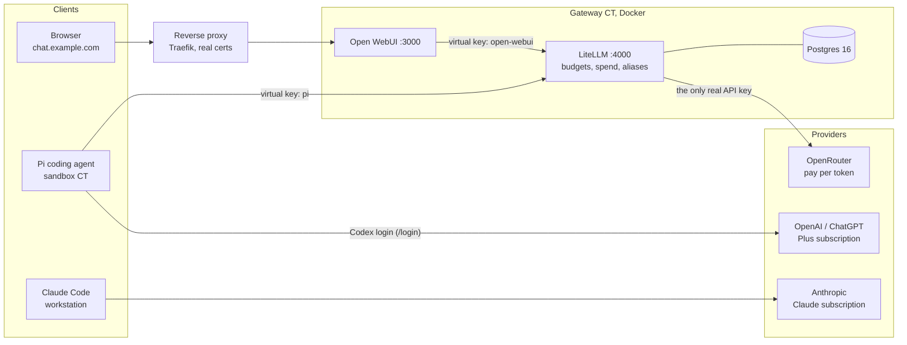

# Self-hosted AI stack: Open WebUI, LiteLLM gateway, and a sandboxed coding agent

## What this is

Two Proxmox LXC containers that give a homelab a private chat UI, a single
budgeted API gateway, and a coding agent that is allowed to run arbitrary shell
commands without being able to reach the real API keys. Subscriptions (ChatGPT
Plus for the Pi agent, Claude for Claude Code) talk to their vendors directly
and never pass through this stack. Everything billed per token (Open WebUI,
Pi's non-subscription models, and possibly Home Assistant and scripts later)
goes through a LiteLLM gateway that holds the only real provider key and hands
each client its own virtual key with a monthly budget.

Everything below was built with Ansible and is described as the final result.

## Architecture



**Which bill pays for what:**

| Traffic | Paid by |
| --- | --- |
| Open WebUI, any model | OpenRouter credits, via LiteLLM |
| Pi on a `litellm/*` model | OpenRouter credits, via LiteLLM |
| Pi on an `openai` (Codex) model | ChatGPT Plus subscription, direct to OpenAI |
| Claude Code | Claude subscription, direct to Anthropic |

Some design decisions that might not be obvious:

- The `chat` alias points at `openai/gpt-5-mini` **through OpenRouter**. That
  is an OpenAI model billed per token as OpenRouter credits. A ChatGPT
  subscription includes no API access, so only tools with a ChatGPT login
  flow (Pi's Codex login, OpenAI's own apps) can use it.
- Claude subscriptions are more restricted: Anthropic doesn't allow them to
  be used through third-party agents, so Claude stays in Claude Code and Pi
  uses ChatGPT or the gateway. See Anthropic's
  [consumer terms](https://www.anthropic.com/legal/consumer-terms).

## Prerequisites

**Accounts**

- ChatGPT Plus (or Pro) for Pi's Codex login.
- OpenRouter with a small prepaid balance.
- A domain with DNS at Cloudflare (or anything your reverse proxy can do a
  DNS-01 challenge against) so internal services get real certificates.
- Optional: a fine-grained GitHub token if you want Pi to push.

**Privacy opt-outs, before sending anything**

- ChatGPT: Settings > Data Controls > **Improve the model for everyone**: off.
- ChatGPT/Codex: the separate **Codex environments** training toggle: off.
  It is a different switch from the one above.
- Claude: Settings > Privacy > **Help improve Claude**: off.
- OpenRouter: check your account's data policy settings, and prefer providers
  that do not train on or retain prompts.

**OpenRouter keys with credit limits**

Create keys in the OpenRouter dashboard, each with its own credit limit:

1. One for the gateway. This is the only key that survives the build.
2. Optional, temporary: one each for Open WebUI and Pi if you build in phases
   like this guide does (direct to OpenRouter first, gateway later). Revoke
   them once the gateway is in front.

**Existing homelab pieces this relies on**

- Proxmox with an SSD-backed storage pool.
- A reverse proxy with wildcard certificates (Traefik with Cloudflare DNS
  challenge here) and a wildcard DNS record pointing `*.example.com` at it.
- Local DNS (AdGuard, Pi-hole, your router) for internal backend hostnames,
  so the proxy targets names rather than raw IPs.
- Ansible with `community.docker`, `community.general` and `ansible.posix`,
  and an Ansible Vault for secrets.

## Containers and sizing

| | Gateway CT | Sandbox CT |
| --- | --- | --- |
| Purpose | Docker host: Open WebUI, LiteLLM, Postgres | Pi coding agent |
| OS | Debian 13 (trixie), unprivileged | Debian 13 (trixie), unprivileged |
| Features | `nesting=1,keyctl=1` (Docker needs both) | `nesting=1` |
| CPU / RAM / swap | 4 cores / 4 GB / 512 MB | 2 cores / 4 GB / 512 MB |
| Disk | 32 GB on ZFS | 32 GB on ZFS |
| Address | `<gateway-ip>` | `<sandbox-ip>` |
| Used after build | ~7.3 GB disk (5.5 GB of images), ~1.5 GB RAM | under 1 GB disk, ~50 MB RAM idle |

Steady-state memory on the gateway: Open WebUI ~660 MB, LiteLLM ~590 MB,
Postgres ~85 MB.

The containers were created with
[`scripts/create-ai-containers.sh`](../../scripts/create-ai-containers.sh),
run on the Proxmox host (`pct create` with the values above, `--onboot 1`, your SSH public key, a
static IP and the local DNS server). It takes a ZFS snapshot named `fresh`
right after creation, so there is always a clean undo point before any
automation touches the container.

## Step by step

All of this is Ansible. Roles: `baseline` (packages, timezone, locale; your
own), plus four new ones: `disable_ipv6`, `docker`, `ai_stack`, `pi_sandbox`.
Every secret lives in the vault, every task that writes one has
`no_log: true`, and every env file on a host is mode `0600`.

### Phase 0: inventory and vault

```yaml
# inventory.yml
ai_stack:
  children:
    ai_gateway:
      hosts:
        ai-gateway:
          ansible_host: <gateway-ip>
    pi_sandbox:
      hosts:
        pi-sandbox:
          ansible_host: <sandbox-ip>
```

Vault variables, added as each phase needs them:

```yaml
# Phase 1
vault_openrouter_key_webui: "..."    # temporary, revoked in Phase 3
vault_webui_secret_key: "..."        # openssl rand -hex 32
# Phase 2
vault_openrouter_key_pi: "..."       # temporary, revoked in Phase 3
vault_pi_github_token: ""            # empty = no GitHub credentials at all
vault_git_email: "..."
# Phase 3
vault_openrouter_key_gateway: "..."
vault_litellm_master_key: "..."      # the "sk" prefix plus a dash is required
vault_litellm_salt_key: "..."        # set once, never change
vault_litellm_db_password: "..."
vault_deepseek_api_key: ""           # optional
# After Checkpoint 3 (created in the LiteLLM UI)
vault_litellm_vkey_webui: "..."
vault_litellm_vkey_pi: "..."
```

Point Ansible at a vault password file (mode `0600`) so playbooks run
unattended. In this repo that is `ANSIBLE_VAULT_PASSWORD_FILE` in `.envrc`;
see the top-level README.

### Phase 1: Open WebUI on the gateway

1. **Disable IPv6 in both containers.** If your containers get a global IPv6
   address from router advertisements but have no working IPv6 route, Node/npm
   and Docker pulls try v6 first and stall. Persist it with
   `ansible.posix.sysctl` into `/etc/sysctl.d/90-disable-ipv6.conf`:
   `net.ipv6.conf.{all,default,eth0}.disable_ipv6 = 1`. These are per network
   namespace, so an unprivileged container can set them for itself.
2. **Install Docker** from Docker's apt repo (`docker-ce`, `docker-ce-cli`,
   `containerd.io`, `docker-buildx-plugin`, `docker-compose-plugin`), then
   assert the storage driver. It must be an overlay driver, not `vfs`, which
   copies every layer in full and fills the disk. See Gotchas for the
   `overlay2` vs `overlayfs` naming.
3. **Template `/opt/ai-stack/compose.yaml`** with Open WebUI only, and its env
   file, then `community.docker.docker_compose_v2` with `state: present`.
   In Phase 1 the env file points straight at OpenRouter:
   `OPENAI_API_BASE_URL=https://openrouter.ai/api/v1`.
4. **Reverse proxy:** a router for `chat.example.com` to
   `http://<gateway-host>:3000`. With a wildcard DNS record already pointing at
   the proxy, no new DNS record is needed.
5. **Create the admin account** in the browser (the first account becomes
   admin), then set `ENABLE_SIGNUP=false` and re-apply.

**Done when:** `docker compose ps` shows `open-webui` as `healthy`, and
`curl -sI https://chat.example.com` returns `200` with a valid certificate.

### Phase 2: Pi in the sandbox

1. Packages: `git tmux curl ca-certificates`.
2. **Node.js from NodeSource.** The major version is pinned by the repo URL
   (`https://deb.nodesource.com/node_24.x`, suite `nodistro`). Add an apt pin
   (`Pin: origin deb.nodesource.com`, priority 1001) so Debian's older `nodejs`
   never wins.
3. **User `agent`** with your SSH public key and **no sudo**. Sudo is not even
   installed. Ansible tasks that must run as `agent` use `become_method: su`
   from root.
4. npm global prefix at `~/.npm-global` (via `~/.npmrc`), on `PATH` from
   `~/.profile`.
5. Install Pi as `agent`:
   `npm install -g --ignore-scripts @earendil-works/pi-coding-agent@<version>`.
   The older `@mariozechner/pi-coding-agent` name is deprecated.
6. `~/.config/pi.env` (mode `0600`, sourced from `~/.profile`). In Phase 2 it
   holds `OPENROUTER_API_KEY`; Phase 3 replaces that with the gateway key.
   `GITHUB_TOKEN` only if you set one.
7. Git identity from the vault. If and only if a token is set, add an HTTPS
   credential helper scoped to `https://github.com` that reads `$GITHUB_TOKEN`
   at call time, so the token is never written to `.gitconfig`.
8. A starter `~/.pi/agent/AGENTS.md`, created only if missing (see
   [`examples/pi/AGENTS.md`](examples/pi/AGENTS.md)), and `~/code/` as the
   workspace.

**Log in to ChatGPT (human step).** Pi's Codex OAuth listens on
`127.0.0.1:1455` inside the sandbox, so tunnel it:

```bash
ssh -L 1455:127.0.0.1:1455 agent@<sandbox-ip>
tmux
pi
# then: /login -> ChatGPT Plus/Pro (Codex)
```

Pick the ChatGPT/Codex login, **not** Claude: Pi's Claude login bills per token
as extra usage. If the browser cannot reach the callback, copy the final
`http://127.0.0.1:1455/auth/callback?...` URL from the address bar and paste it
into Pi when it asks.

Then take a Proxmox snapshot of the sandbox (`pi-ready`).

**Done when:** as `agent`, `pi --version` prints the pinned version,
`npm ping` returns `PONG`, `ip -6 addr show scope global` is empty, and (with a
token) `git ls-remote` works against a repo the token can see.

### Phase 3: LiteLLM gateway

1. **Add LiteLLM and Postgres** to the same compose project. See
   [`examples/compose.yaml`](examples/compose.yaml). LiteLLM waits for
   Postgres's healthcheck; LiteLLM's own healthcheck hits
   `/health/liveliness`. Port `4000` is published on the LAN because the
   sandbox calls it directly.
2. **Verify the image signature before pinning it.** LiteLLM signs releases
   with cosign. No need to install cosign anywhere; run it as a container on
   the gateway:

   ```bash
   docker run --rm ghcr.io/sigstore/cosign/cosign:v3.1.3 verify \
     --key https://raw.githubusercontent.com/BerriAI/litellm/0112e53046018d726492c814b3644b7d376029d0/cosign.pub \
     ghcr.io/berriai/litellm:v1.104.1
   ```

   Then pin the image as `tag@sha256:<verified digest>` so the tag cannot be
   moved under you.
3. **One env file per service** under `/opt/ai-stack/env/` (directory `0700`,
   files `0600`): see [`examples/env/`](examples/env/). Compose's `env_file`
   injects every variable in a file into the container, so a shared `.env`
   would give Open WebUI the master key and LiteLLM the Open WebUI key.
4. **`/opt/ai-stack/litellm/config.yaml`** with aliases, no secrets
   (keys come in as `os.environ/...`). See
   [`examples/litellm/config.yaml`](examples/litellm/config.yaml):
   - `chat` -> `openrouter/openai/gpt-5-mini`
   - `deepseek-flash` -> `openrouter/deepseek/deepseek-v4.1-flash`
   - `deepseek-flash-direct` -> `deepseek/deepseek-flash`, only templated in
     if a DeepSeek key is set
   - **No fallbacks**, on any alias or at router level.
5. The config file is a bind mount, so compose does not notice when it
   changes. Use a handler that restarts just the `litellm` service.
6. **Reverse proxy:** `llm.example.com` -> `http://<gateway-host>:4000`.

**Done when:** `curl http://<gateway-ip>:4000/health/liveliness` returns
`"I'm alive!"`, and a completion against the `chat` alias with the master key
succeeds. Run that test as a small script **on the gateway** that reads the
key from the env file, so the key never shows up in your terminal or logs.

**Create virtual keys (human step).** Log in at `https://llm.example.com/ui/`
(username `admin`, password is the master key) and under **Virtual Keys**
create `open-webui` and `pi`:

- Owned By: **You** (Service Account works too but requires a Team)
- Models: the aliases that client may use
- Optional Settings: Max Budget (USD) and a monthly (`30d`) reset

Copy each key immediately; it is shown once. Put both in the vault.

**Replace the master-key UI login (human step, then one variable).** Under
**Internal Users**, invite a user with role `proxy_admin`, open the invite
link it generates to set a password (no email server needed), and confirm
you can sign in as that user. Then set
`ai_stack_litellm_disable_env_credential_login: true` and re-run the
playbook. LiteLLM now refuses the master key on the login page, and the
red warning banner goes away. Do it in this order: enabling it before the
admin user exists locks everyone out of the UI. The master key still works
for API calls, so a lockout is recoverable by unsetting the variable.

**Switch the clients to the gateway:**

- **Open WebUI:** env becomes `OPENAI_API_BASE_URL=http://litellm:4000/v1`
  with the `open-webui` key. Open WebUI ignores this after first launch
  (see Gotchas), so also edit **Admin Panel > Settings > Connections**: same
  URL, Bearer auth, the virtual key, click verify, save the dialog **and** the
  page.
- **Pi:** add the gateway as a provider in `~/.pi/agent/models.json`
  ([`examples/pi/models.json`](examples/pi/models.json)). `apiKey` is
  `"$LITELLM_API_KEY"`, which Pi interpolates from the environment at request
  time, so the key only lives in the `0600` `pi.env`
  ([`examples/pi/pi.env`](examples/pi/pi.env)). Remove `OPENROUTER_API_KEY`
  from `pi.env`. Leave the Codex login alone.
- Remove the temporary per-client OpenRouter keys from every template, check
  nothing on the sandbox still holds one (`auth.json` providers, stray OpenRouter
  strings, old tmux sessions), then revoke them in OpenRouter.

**Done when:** a prompt from Open WebUI and one from Pi each show up as spend
under their own key in LiteLLM (`/key/list` with the master key, or the
Virtual Keys page).

## Security notes

- **Pinned everything.** Images by exact tag, LiteLLM additionally by
  cosign-verified digest. Pi by exact npm version, installed with
  `--ignore-scripts`. Node by major via the NodeSource repo URL. No `latest`,
  `main` or floating aliases anywhere, including OpenRouter's `~...-latest`
  model aliases.
- **Gateway and sandbox are separate containers on purpose.** Pi runs
  arbitrary shell commands. The only credentials on the sandbox are its own
  budgeted LiteLLM virtual key (revocable in one click) and the ChatGPT login.
  The real OpenRouter key lives only in LiteLLM's env file on the gateway.
- **No sudo for the agent.** The `agent` user cannot escalate, and the
  sandbox has nothing else worth escalating to.
- **Scoped GitHub token, or none.** If Pi needs to push, use a fine-grained
  token limited to the repos it should touch, Contents read/write only. The
  credential helper reads it from the environment, scoped to `github.com`.
  Without a token Pi can still clone public repos and work locally.
- **No fallbacks for private models.** A local-model alias is planned. A
  LiteLLM fallback on it would silently send private prompts to a cloud
  provider whenever the local model is down, so the config has no fallbacks
  at all, and adding one should be a deliberate decision.
- **Not exposed to the internet.** Both hostnames resolve only on the LAN and
  over Tailscale; no tunnels, no port forwards.
- **The LiteLLM supply-chain incident.** In March 2026 LiteLLM's PyPI package
  was compromised. The Docker image was not affected, which is one reason
  this stack runs the image rather than `pip install litellm`, and why the
  image is verified with cosign and pinned by digest.
- **Master-key UI login is turned off.** By default LiteLLM lets the master
  key sign in to the Admin UI (its fallback when `UI_PASSWORD` is unset) and
  shows a red warning banner. This build signs in with a `proxy_admin`
  database user instead and sets `general_settings.disable_env_credential_login:
  true` through `ai_stack_litellm_disable_env_credential_login`, so the login
  page rejects the master key. The master key still authenticates API calls,
  so it remains an admin credential and stays only in the gateway's env file.

## Costs

- ChatGPT Plus: about $20/month, flat, for Pi's Codex models.
- API credits: $5 to $10/month of OpenRouter for Open WebUI and Pi's cheap
  models. Each LiteLLM virtual key has its own monthly budget ($10 each
  here), and the OpenRouter key's credit limit is the hard backstop.
- For scale: the verification prompts in this build cost fractions of a cent.

## Gotchas hit during this build

1. **Docker 29 reports `overlayfs`, not `overlay2`.** New installs default to
   the containerd image store, whose overlay snapshotter shows up as
   `overlayfs` in `docker info`. It is the same kernel overlay; accept both
   and only fail on `vfs`. On a ZFS 2.2+ rootfs it worked out of the box.
2. **Open WebUI persists config in its database after first launch.**
   Changing `OPENAI_API_BASE_URL`/`OPENAI_API_KEY` in the env file and
   recreating the container did not change the connection it used. Change it
   in Admin Panel > Settings > Connections. (`ENABLE_SIGNUP=false` did take
   effect from env; check `/api/config` rather than assuming either way.)
3. **A shared compose `.env` leaks every secret into every container.** Use
   one `env_file` per service.
4. **Open WebUI ships with an Ollama connection turned on.** With no Ollama
   running it just fails in the background. Turn it off under Connections
   until you have a local model.
5. **The newest Pi release was a few hours old.** Pinned the previous patch
   release instead and left the bump for later. Fast-moving projects ship
   several releases a week; give one a day or two.
6. **Pi's Codex login needs an SSH tunnel** for `127.0.0.1:1455`, with a
   paste-the-redirect-URL fallback. If port 1455 is already taken on your
   workstation, the Codex CLI is probably running.
7. **Running tmux sessions keep old environment variables.** After changing
   `pi.env`, existing tmux servers still hold the old keys. Kill them (or
   check `/proc/<pid>/environ`) before revoking a key.
8. **LiteLLM virtual keys with no models selected can use every alias.**
   Fine with two aliases; restrict per key before adding a private one.
9. **Compose does not see changes to bind-mounted config files.** Restart the
   service from a handler when `config.yaml` changes.
10. **`become` to an unprivileged user without sudo.** Use
    `become_method: su` from root, and set `HOME` explicitly for npm and
    `git config --global`.
11. **Never `docker compose down -v`.** The named volumes hold Open WebUI's
    users and chats and LiteLLM's keys and spend history.

## Pinned versions (2026-10-08)

| Component | Version | Notes |
| --- | --- | --- |
| Debian (both CTs) | 13.6 (trixie) | `debian-13-standard_13.6-1` LXC template |
| Docker Engine | 29.8.2 | Docker apt repo, not pinned beyond the repo |
| Docker Compose plugin | 5.6.0 | |
| Open WebUI | `ghcr.io/open-webui/open-webui:v0.11.4` | released 2026-09-21 |
| LiteLLM | `ghcr.io/berriai/litellm:v1.104.1@sha256:501909ec6f504551f263f82fe8c53cfa34679d5753de507a2df69680a6021ad8` | cosign-verified |
| Postgres | `postgres:16.15` | |
| cosign (verification only) | `ghcr.io/sigstore/cosign/cosign:v3.1.3` | |
| Node.js | 24.21.0 (NodeSource `node_24.x`) | current LTS (Krypton) |
| Pi | `@earendil-works/pi-coding-agent@1.0.4` | 1.1.0 was out but hours old |
| `chat` model | `openai/gpt-5-mini` via OpenRouter | |
| `deepseek-flash` model | `deepseek/deepseek-v4.1-flash` via OpenRouter | |
| Ansible collections | `community.docker` 5.2.2, `community.general` 13.3.0, `ansible.posix` 2.2.2 | |
